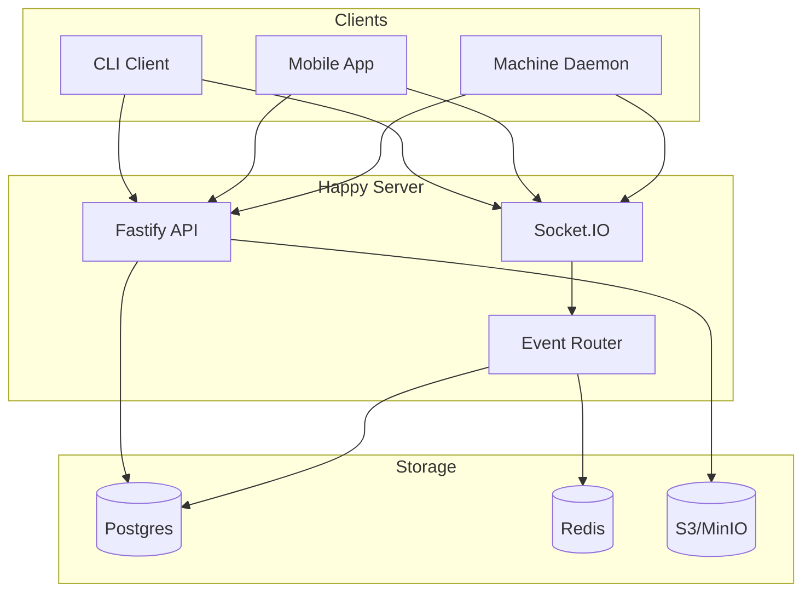
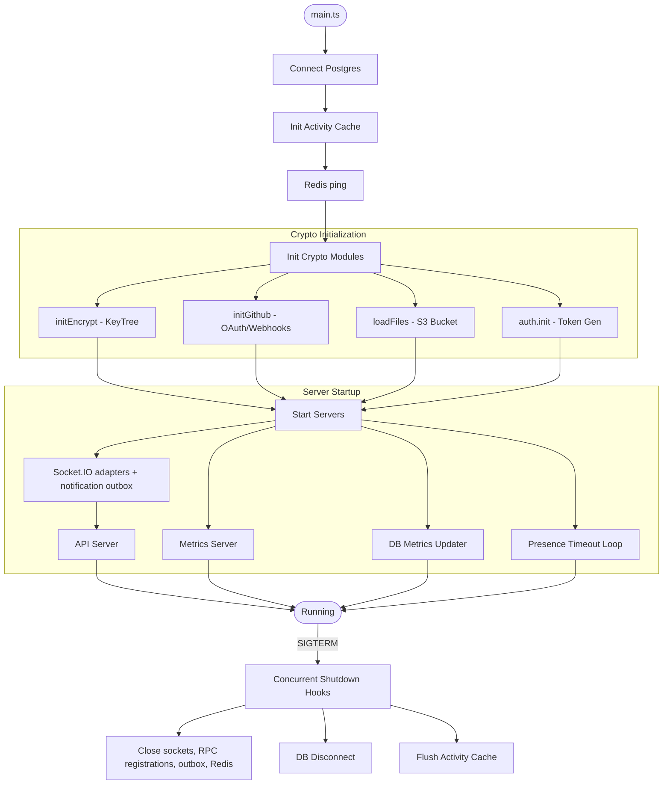
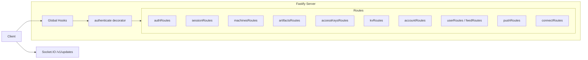
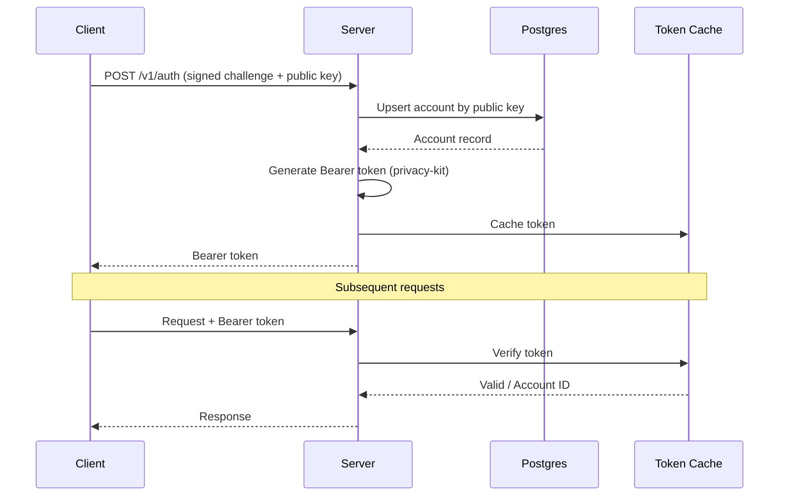
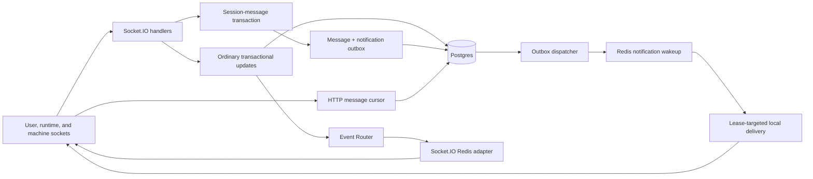
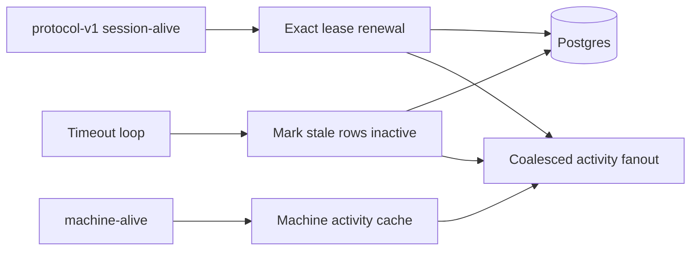
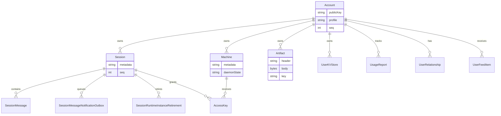
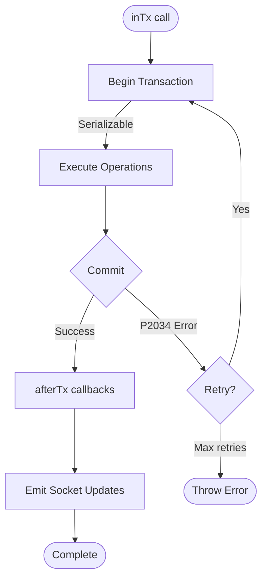
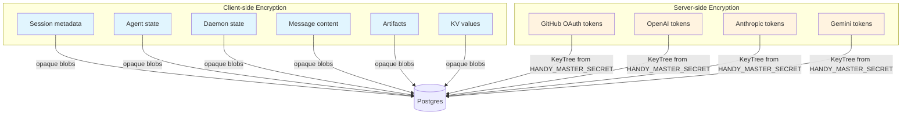

# Backend Architecture

This document describes the Happy backend structure implemented in this
repository. It focuses on how the server is wired, how data flows through the
system, and which subsystems handle which responsibilities.

## System overview

## At a glance
- Runtime: Node.js + Fastify for HTTP, Socket.IO for realtime.
- Database: Postgres via Prisma.
- Realtime bus: Redis carries Socket.IO fanout, committed-message wakeups, and
  TTL-bound RPC registrations. It is not canonical message storage.
- Blob storage: S3-compatible (MinIO) for uploaded assets.
- Crypto: privacy-kit for auth tokens and encrypted service tokens.
- Metrics: Prometheus-style `/metrics` server + per-request HTTP metrics.

## Process lifecycle
Entry point: `sources/main.ts`.

Startup sequence:
1. Connect Postgres (`db.$connect()`).
2. Init activity cache (presence) and Redis connection check (`redis.ping()`).
3. Initialize crypto modules:
   - `initEncrypt()` derives a KeyTree from `HANDY_MASTER_SECRET`.
   - `initGithub()` configures GitHub App/webhooks if env vars exist.
   - `loadFiles()` verifies S3 bucket access.
   - `auth.init()` prepares token generator/verifier.
4. Start Socket.IO Redis adapters, the durable message notification subscriber
   and dispatcher, then begin accepting HTTP/Socket.IO traffic.
5. Start the metrics server, database metrics updater, and presence timeout loop.
6. Remain alive until shutdown signal.

On SIGTERM, the shutdown controller aborts and invokes the registered API,
socket, storage, Redis, and `keepAlive` handlers concurrently. There is no
global application timeout or guaranteed phase ordering. In particular, the
presence timeout loop does not currently stop at the aborted delay and can
re-enter database work until another shutdown handler disconnects Prisma.
Docker's 45-second grace period is therefore the outer bound; it may end with a
forced process stop rather than a completed graceful drain. The production
image executes the app as PID 1 so SIGTERM reaches these hooks. See
[`known-limitations.md`](known-limitations.md) before changing shutdown or
deployment behavior.

## API layer
`startApi()` in `sources/app/api/api.ts` wires the HTTP server:
- Fastify instance with Zod validators/serializers.
- Global hooks for monitoring and error handling.
- `authenticate` decorator that verifies Bearer tokens.
- Route modules under `sources/app/api/routes`.
- Socket.IO server attached at `/v1/updates`.

HTTP routes are organized by domain:
- Auth (`authRoutes`)
- Sessions + messages (`sessionRoutes`)
- Machines (`machinesRoutes`)
- Artifacts (`artifactsRoutes`)
- Access keys (`accessKeysRoutes`)
- Key-value store (`kvRoutes`)
- Account + usage (`accountRoutes`)
- Social + feed (`userRoutes`, `feedRoutes`)
- Push tokens (`pushRoutes`)
- Integrations (`connectRoutes`)
- Version checks (`versionRoutes`)
- Dev-only logging (`devRoutes`)

## Authentication and tokens

The backend does not store passwords. Instead:
- Clients authenticate with a signed challenge (`/v1/auth`) using a public key.
- The server upserts the account by public key and returns a Bearer token.
- Tokens are generated and verified by privacy-kit using `HANDY_MASTER_SECRET`.
- Tokens are cached in-memory for fast verification.

GitHub OAuth uses short-lived "ephemeral" tokens to protect the callback and is separate from normal auth.

## Realtime sync architecture

### Connection types
Socket.IO connections are tagged by scope:
- `user-scoped`: receive all user updates.
- `session-scoped`: receive updates only for one session.
- `machine-scoped`: daemon connections for machine state.

### Event router
`EventRouter` (`sources/app/events/eventRouter.ts`) maintains local connection
metadata and Socket.IO rooms, and routes:

- **Ordinary persistent `update` events**: database-backed changes with a
  user-level monotonic `seq`, emitted after their transaction commits.
- **Durable session-message notifications**: delivered only after the
  PostgreSQL outbox commits. Every server consumes the lossy Redis wakeup but
  emits only to its local user observers and the exact runtime lease captured
  by the outbox row.
- **Ephemeral events**: presence/usage signals that are not persisted as update
  history.

Live notifications may duplicate or be lost. Clients deduplicate and repair
gaps with the ascending HTTP message cursor; PostgreSQL is authoritative.

### Update sequence numbers
- `Account.seq` is the per-user update counter. It is incremented by `allocateUserSeq` and used as `UpdatePayload.seq`.
- Sessions and artifacts maintain their own `seq` for per-object ordering.

## Presence and activity

Presence is handled in `sources/app/presence`:

- Protocol-v1 `session-alive` renews the exact process-incarnation/socket-lease
  tuple directly with PostgreSQL time. A stale socket observes its failed CAS
  and is disconnected.
- Session activity fanout is coalesced after the durable renewal. Untouched
  legacy sessions have a narrow compatibility path and cannot update a
  lease-managed row.
- Machine activity remains coalesced for efficient presence fanout.
- A timeout loop marks stale sessions/machines inactive and emits an offline
  ephemeral update.

Runtime readiness uses a four-minute persisted lease, not the ten-minute
display-presence timeout.

## Storage and persistence
### Database (Prisma)
Prisma models live in `prisma/schema.prisma`. Key tables:

- `Account`: public key identity, profile, settings, seq counters.
- `Session` + `SessionMessage`: encrypted session metadata and message blobs,
  plus the current runtime process/socket lease.
- `SessionMessageNotificationOutbox`: transactionally commits each message's
  live-notification intent, exact target runtime lease, retry state, and
  delivery marker. Delivery is FIFO per session; delivered rows are retained
  for 24 hours, while cursor replay is the long-term recovery path.
- `SessionRuntimeInstanceRetirement`: durable, non-reusable
  process-incarnation tombstones with `replaying`, `ended`, or `superseded`
  status.
- `Machine`: encrypted machine metadata + daemon state.
- `Artifact`: encrypted header/body + per-artifact key.
- `AccessKey`: encrypted per-session-per-machine access keys.
- `UserKVStore`: encrypted values with optimistic versions.
- `UsageReport`: usage aggregation per session/key.
- `UserRelationship` + `UserFeedItem`: social graph and feed.

### Transactions and retries

`inTx()` wraps Prisma transactions with:
- Serializable isolation.
- Automatic retry on `P2034` (serialization failures).
- `afterTx()` to emit ordinary socket updates after commit.

This pattern is used for multi-write operations like batch KV mutation and
session deletion. Session messages use the stronger transactional outbox: the
message and notification row commit atomically instead of depending on an
in-memory after-commit callback.

### Blob storage (S3/MinIO)
The server uses S3-compatible storage for user assets (e.g., avatars):
- `storage/files.ts` configures the S3 client.
- `uploadImage` processes and stores files and writes metadata to `UploadedFile`.
- Public URLs are derived from `S3_PUBLIC_URL`.

### Redis

Redis is required at startup and currently has three realtime roles:

- the official Socket.IO adapter provides transient cross-process room fanout;
- a dedicated Pub/Sub channel wakes local delivery of committed message-outbox
  rows; and
- TTL-bound RPC registry entries map a method to one socket generation.

Redis Pub/Sub is intentionally lossy and RPC registration clients disable
offline queuing and automatic command resend. PostgreSQL owns message history,
outbox retry state, runtime leases, and retirement history.

Runtime-owned RPC is dispatched only to an exact local socket while a
PostgreSQL owner lock is held. Production therefore supports one Happy server
replica until a receiver-side relay can reacquire the same fence before local
dispatch.

## Data confidentiality model

- Session metadata, agent state, daemon state, and message content are stored as opaque encrypted strings or blobs.
- Artifacts and KV values are stored encrypted and encoded as base64 on the wire.
- The server only encrypts/decrypts **service tokens** (GitHub OAuth tokens, vendor tokens) using the KeyTree derived from `HANDY_MASTER_SECRET`.

## Integrations
- **GitHub**: OAuth connect + webhook verification exists in source, but the
  Boujot Compose deployment does not currently propagate its environment
  variables and callback completion redirects to the upstream Happy web app.
  Treat it as unavailable in this fork's production deployment.
- **AI vendors**: encrypted token storage for `openai`, `anthropic`, `gemini`.
- **Push tokens**: CRUD registry only. Boujot/Happy CLI owns best-effort Expo
  delivery; the server does not run a durable push-delivery worker. See
  [Known limitations](known-limitations.md#push-delivery-is-client-owned-and-not-durable).

## Observability
- `/health` route checks DB connectivity.
- Metrics server exposes `/metrics` for Prometheus.
- HTTP request counters and duration histograms are captured via Fastify hooks.
- WebSocket event counters and connection gauges are in `metrics2.ts`.

## Key implementation references
- Entrypoint: `sources/main.ts`
- API server: `sources/app/api/api.ts`
- Socket server: `sources/app/api/socket.ts`
- Event routing: `sources/app/events/eventRouter.ts`
- Runtime leases: `sources/app/presence/runtimeConnectionLease.ts`
- Message outbox: `sources/app/session/sessionMessageNotificationOutbox.ts`
- Presence: `sources/app/presence`
- Storage: `sources/storage`
- Prisma schema: `prisma/schema.prisma`
